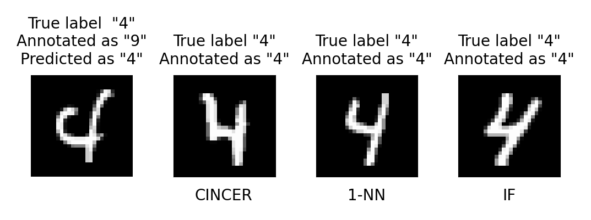
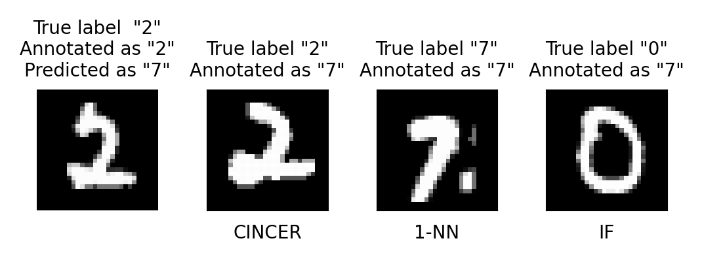

# Interactive Label Cleaning with Example-based Explanations

Implementation of:

Teso, S., Bontempelli, A., Giunchiglia, F., & Passerini, A. (2021). Interactive Label
Cleaning with Example-based Explanations. arXiv preprint
[arXiv:2106.03922](https://arxiv.org/pdf/2106.03922.pdf).

|the suspicious example is mislabeled|the counter-example is mislabeled|
|---|---|
|||

### Abstract

We tackle sequential learning under label noise in applications where a human supervisor
can be queried to relabel suspicious examples. Existing approaches are flawed, in that 
they only relabel incoming examples that look "suspicious" to the model. 
As a consequence, those mislabeled examples that elude (or don't undergo) this cleaning 
step end up tainting the training data and the model with no further chance of being 
cleaned. We propose CINCER, a novel approach that cleans both new and past data by 
identifying \emph{pairs of mutually incompatible examples}. Whenever it detects a 
suspicious example, CINCER identifies a counter-example in the training set that - according 
to the model - is maximally incompatible with the suspicious example, and asks the annotator 
to relabel either or both examples, resolving this possible inconsistency. 
The counter-examples are chosen to be maximally incompatible, so to serve as 
\emph{explanations} of the model' suspicion, and highly influential, so to convey 
as much information as possible if relabeled. CINCER achieves this by leveraging 
an efficient and robust approximation of influence functions based on the 
Fisher information matrix (FIM). Our extensive empirical evaluation shows that 
clarifying the reasons behind the model's suspicions by cleaning the counter-examples 
helps acquiring substantially better data and models, especially when paired with our 
FIM approximation.


### Dependencies

- Python >= 3.8. Older versions may also work.
- Tensorflow 2.4.1

Create an environment:

```shell
$ conda env create -f environment.yml
```

In addition, you'll need this repository:
```shell
$ git clone https://github.com/stefanoteso/example-based-explanation influence
```
Make sure that the `influence` directory can be imported by `main.py`.


### Reproducing the experiments

**Q1 and Q3**

```shell
$ ./run_image_datasets.sh
$ ./run_tabular_datasets.sh
```

To plot the results

```shell
$ ./plot_q1_q3.sh
```

**Q2**

```shell
$ ./run_pratk.sh
```

To plot the results

```shell
$ ./plot_pratk.sh
```

### Running
Show help message:

```
$ python main.py -h

usage: main.py [-h] [--no-cache] [--seed SEED] [-R N_REPEATS] [-T MAX_ITERS]
               [-k P_KNOWN] [-p P_NOISE] [--noise-type NOISE_TYPE]
               [--ce-precision] [--bits {32,64}] [-B BATCH_SIZE] [-E N_EPOCHS]
               [--from-logits] [-I INSPECTOR] [-N NEGOTIATOR] [-t THRESHOLD]
               [--no-reload] [--no-ce] [--nfisher-radius NFISHER_RADIUS]
               [--if-damping IF_DAMPING] [--lissa-depth LISSA_DEPTH]
               [--lissa-samples LISSA_SAMPLES]
               exp_name question
               {20ng,adult,breast,cifar10,fashion_mnist,german,iris,mnist,mnist49,synthetic,wine}
               {convnet,fullnet,kernel_logreg,logreg}

positional arguments:
  exp_name
  question              research question to be answered
  {20ng,adult,breast,cifar10,fashion_mnist,german,iris,mnist,mnist49,synthetic,wine}
                        name of the dataset
  {convnet,fullnet,kernel_logreg,logreg}
                        model to be used

optional arguments:
  -h, --help            show this help message and exit
  --no-cache            Do not use cached model (default: False)
  --seed SEED           RNG seed (default: 1)

Evaluation:
  -R N_REPEATS, --n-repeats N_REPEATS
                        # of times the experiment is repeated (default: 10)
  -T MAX_ITERS, --max-iters MAX_ITERS
                        # of interaction rounds (default: 100)
  -k P_KNOWN, --p-known P_KNOWN
                        Proportion or # of initially known training examples
                        (default: 1)
  -p P_NOISE, --p-noise P_NOISE
                        Noise rate (default: 0)
  --noise-type NOISE_TYPE
  --ce-precision        precision of fisher in finding counterexamples
                        (default: False)
  --bits {32,64}

Model:
  -B BATCH_SIZE, --batch-size BATCH_SIZE
                        Batch size (default: 1024)
  -E N_EPOCHS, --n-epochs N_EPOCHS
                        Number of epochs (passes through the dataset)
                        (default: 10)
  --from-logits         Use logit trick *KILLS EXP ∇ LEN!* (default: False)

Method:
  -I INSPECTOR, --inspector INSPECTOR
                        inspector to be used (default: always)
  -N NEGOTIATOR, --negotiator NEGOTIATOR
                        negotiator to be used (default: random)
  -t THRESHOLD, --threshold THRESHOLD
                        Suspicion threshold (default: 0)
  --no-reload           whether to reload the initial model in every iter
                        (default: False)
  --no-ce               negotiates without counter-examples (default: False)
  --nfisher-radius NFISHER_RADIUS

Influence Functions:
  --if-damping IF_DAMPING
                        Hessian preconditioner (default: 0)
  --lissa-depth LISSA_DEPTH
                        LISSA recursion depth (default: 1000)
  --lissa-samples LISSA_SAMPLES
                        LISSA recursion depth (default: 1)
```

Plot:

```
$ python draw.py -h

usage: draw.py [-h] [-o OUTPUT_PATH]
               [--question {q1,q3,eval_influence,eval_ce}] [--summary] [--sup]
               [--style-by {noise,threshold,inspector,negotiator}]
               pickles [pickles ...]

positional arguments:
  pickles               comma-separated list of pickled results

optional arguments:
  -h, --help            show this help message and exit
  -o OUTPUT_PATH        output folder (default: .)
  --question {q1,q3,eval_influence,eval_ce}
  --summary             plot F1 and # cleaned only (default: False)
  --sup                 plot F1, # cleaned and # queries only (default: False)
  --style-by {noise,threshold,inspector,negotiator}
                        color plots by threshold rather than by negotiator
                        (default: None)
```

### Acknowledgments
This research has received funding from the European Union’s Horizon 2020 FET Proactive
project“WeNet - The Internet of us”, grant agreement No. 823783, and from the 
“DELPhi - DiscovEring LifePatterns” project funded by the MIUR Progetti di Ricerca di 
Rilevante Interesse Nazionale (PRIN) 2017 – DD n. 1062 del 31.05.2019. The research of ST
and AP was partially supported by TAILOR,a project funded by EU Horizon 2020 research 
and innovation programme under GA No 952215.

### Cite

```markdown
@article{teso2021interactive,
  title={Interactive Label Cleaning with Example-based Explanations},
  author={Teso, Stefano and Bontempelli, Andrea and Giunchiglia, Fausto and Passerini, Andrea},
  journal={arXiv preprint arXiv:2106.03922},
  year={2021}
}
```